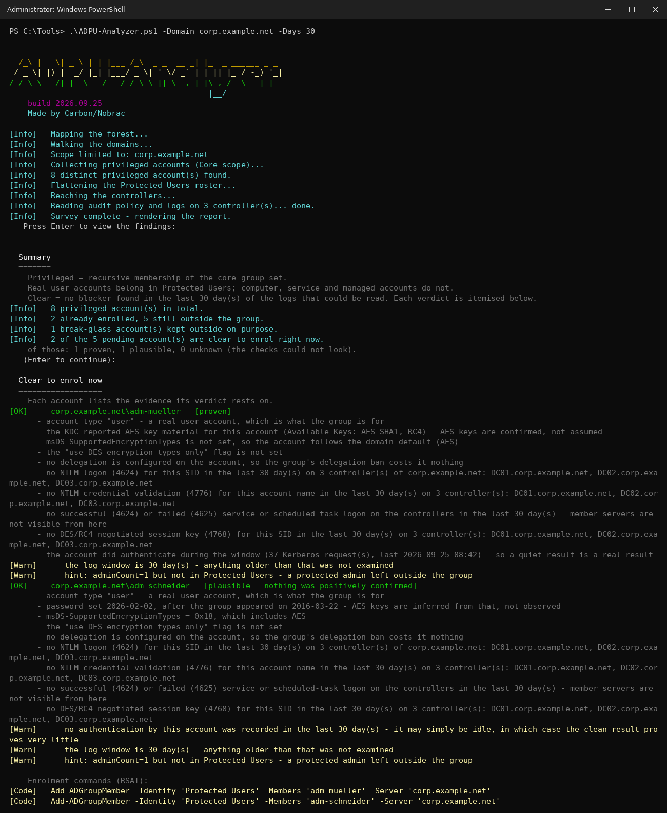

<div align="center">

# ADPU-Analyzer

### Find out which privileged Active Directory accounts you can safely move into the **Protected Users** group — and which ones still need work first.

A single read-only PowerShell script that surveys a forest, scores every privileged account, and tells you plainly: **who is clear to enrol now**, **how strong the evidence behind that actually is**, **who is blocked and why**, and — after enrolling — **whether it held**.


&nbsp;

&nbsp;

&nbsp;
[](LICENSE)

[Features](#what-it-checks) · [Quick start](#quick-start) · [Confidence](#how-the-verdict-works) · [Verification](#post-enrolment-verification) · [Limitations](#limitations--notes)

<br>



<sub>The readiness walkthrough: bottom line first, then the accounts that are clear to enrol — each with the evidence behind the verdict and a ready-to-run command.</sub>

</div>

---

Checking every Windows event log by hand for NTLM logons and weak Kerberos usage — just to be sure an account can join the *Protected Users* group without breaking its sign-in — is tedious and easy to get wrong. So I built this tool to do it for me.

The *Protected Users* group hardens its members against common credential attacks: no NTLM, no DES/RC4 Kerberos, no delegation, no long-lived credential caching. The catch is that those protections **cannot be turned off per member**. Add an account that still relies on legacy authentication and it may suddenly **fail to log in** — and if that account is a Domain Admin, you find out the hard way. ADPU-Analyzer surfaces that risk *before* you make the change. It never modifies the directory; it prints the commands for you to run yourself, including the one that gets you back out.

> [!NOTE]
> **Built with AI assistance.** Parts of the code and this documentation were written with Claude (Anthropic) in a pair-programming workflow: I defined the requirements, reviewed the results, and tested everything in a real Active Directory environment. As with any code you did not write yourself, review it before running it in production.

---

## Contents

- [What it checks](#what-it-checks)
- [How the verdict works](#how-the-verdict-works)
- [Requirements](#requirements)
- [Auditing prerequisites](#auditing-prerequisites)
- [Quick start](#quick-start)
- [Parameter reference](#parameter-reference)
- [Automation](#automation)
- [Post-enrolment verification](#post-enrolment-verification)
- [Limitations & notes](#limitations--notes)
- [Repository layout](#repository-layout)
- [License](#license)

---

## What it checks

Privileged accounts are the recursive membership of a group set, expanded across every domain in scope.

| Scope | Groups |
| --- | --- |
| `Core` (default) | Administrators, Domain Admins, Enterprise Admins, Schema Admins |
| `Extended` | the above plus Account/Server/Print/Backup Operators, Group Policy Creator Owners, Key Admins, Enterprise Key Admins, DnsAdmins |

`-IncludeGroup` folds in anything else, by SID or by name.

### Blockers — these decide the verdict

| Check | Source | Why it blocks |
| --- | --- | --- |
| **NTLM at a controller** | Security **4624**, `AuthenticationPackageName = NTLM` | Members cannot authenticate over NTLM at all. |
| **NTLM anywhere in the estate** | Security **4776** (credential validation), **successful** validations only | The case 4624 never sees: NTLM against a member server or workstation reaches the DC as 4776. Failed validations alone are a hint, not a blocker — they show someone *trying* NTLM with the name (a stale saved password, or a password spray), not a working dependency. |
| **No AES key material** | **4768** → *Available Keys* | Direct evidence from the KDC that the account has no AES key. Beats every guess. |
| **Password predates the group** | `pwdLastSet` vs. the group's `whenCreated` | Fallback for the above, used **only** when no key material was observed. |
| **DES/RC4 Kerberos** | **4768** *Session Key Encryption Type* (newer controllers) — *Ticket Encryption Type* only as a fallback on older ones | DES and RC4 are refused for members. See [the krbtgt trap](#the-krbtgt-trap) for why the ticket field alone is weak evidence. |
| **DES only** | `userAccountControl & 0x200000` | Forces exactly the cipher the group rejects. |
| **No AES in the etype mask** | `msDS-SupportedEncryptionTypes` set, non-zero, without AES128/AES256 | Same result, configured on the account itself. Absent or `0` means the domain default (AES) and is fine. |
| **Delegation configured** | `msDS-AllowedToDelegateTo`, UAC `0x1000000`, UAC `0x80000` | Members cannot delegate — constrained, protocol transition or unconstrained. Anything relying on it breaks. |
| **Wrong account type** | `objectClass` | Computer, service and **gMSA** accounts must never be members — a gMSA gets its own hint pointing at authentication policy silos instead. |
| **Disabled account** | `userAccountControl` | Enrolling a disabled admin achieves nothing — the fix is to take it out of the admin groups. |
| **Group present & effective** | Domain functional level, DC operating systems | Below 2012 R2 DFL there are client-side protections only; without the group there is nothing to join. |

The AD-derived checks come straight out of the directory, so unlike the log-based ones they are reliable even when auditing was switched off.

### Hardening hints — informational, never affect the verdict

`adminCount=1` but not in Protected Users · a user account carrying an **SPN** (a service account in disguise) · *password never expires* · password over a year old · *no Kerberos pre-auth* (AS-REP roastable) · **failed** NTLM validations without a successful one (named by workstation) · Kerberos requests from a **client that offered no AES** (named by IP) · a break-glass account that *is* enrolled.

### Things no tool can clear you of

The report says so out loud, because none of it is readable from the directory:

- The TGT is fixed at **4 hours** and cannot be renewed — long-running scheduled tasks and batch jobs that rely on renewal stop.
- **No credential caching**, so **no offline sign-in**. An admin on a laptop away from a controller cannot log in.
- **CredSSP and WDigest** no longer hold the credential — tooling that delegates credentials breaks.
- Protections apply from the **next fresh logon**. An existing session or ticket hides the problem for hours.

---

## How the verdict works

Every pending account lands in one of two lists, and **both are itemised** — the tool shows its reasoning rather than asking you to trust a green line. Clear accounts additionally carry a **confidence**, because "we found nothing" and "we could not look" are not the same answer:

| Confidence | Meaning |
| --- | --- |
| **Proven** | AES key material was observed in the logs, the account really did authenticate inside the window, every controller in its domain was fully audited, completely read and new enough to report the modern 4768 fields — and the window was at least **14 days**. |
| **Plausible** | No blocker found, but nothing positively confirmed — typically a quiet account, partial audit coverage, a controller that was only partly read, or a window shorter than 14 days. |
| **Unknown** | The checks could not look at all. A clean result here means nothing whatsoever. |

> [!IMPORTANT]
> The log-based checks are **backward-looking**. They see what is in the current event logs, and only where auditing was enabled. An account that simply has not used NTLM *recently* looks identical to one that never will — which is exactly what the confidence column is there to tell you.

### Evidence is scoped to the account's own domain

A controller in another domain never authenticates this account, so counting it as coverage overstated the case. Each account is judged against the controllers of **its own** domain, resolved from the account's SID rather than from whichever group happened to contain it. That matters for `Builtin\Administrators`, which is domain-local and can hold users from other domains in the forest.

### Members homed outside the reviewed scope

`Builtin\Administrators` is domain-local, so reviewing one domain routinely turns up admins that live in a sibling domain. A privileged member whose own domain was not part of the run gets a **third state**, alongside clear and blocked: one line, under its real domain name, with no verdict. Judging it would mean borrowing another domain's evidence — and since the 4776 event carries only an account name, a `admin` that exists once per domain would otherwise collect every domain's NTLM findings. These members count as a coverage gap (exit code `2`), not as blockers, and they are never repeated in the hardening hints.

If you only want the domain you picked and nothing else, `-StrictScope` drops them before anything downstream sees them — no section, no counts, no effect on the exit code:

```powershell
.\ADPU-Analyzer.ps1 -Domain corp.example.net -StrictScope
```

It is not the default, because a foreign account holding admin rights in your domain is usually something you want to know about. The report says how many were removed either way.

### Break-glass accounts

At least one emergency admin account should stay **outside** Protected Users, so that a side effect nobody foresaw cannot lock out every administrator at once. The built-in Administrator (RID 500) is always treated that way; `-BreakGlass` adds more:

```powershell
.\ADPU-Analyzer.ps1 -BreakGlass 'CORP\emergency', 'S-1-5-21-...-1190'
```

These accounts get their own section — neither *clear* (no enrolment command is printed for them) nor *blocked*, and they do not affect the exit code. If one of them is already enrolled, that is flagged as a hint.

### The krbtgt trap

The *Ticket Encryption Type* in event 4768 is the encryption of the TGT itself — which the KDC picks from the **krbtgt** account's keys, on every build. It says nothing about the account that asked. A krbtgt without AES therefore makes *every* account in the domain look like an RC4 user, and a krbtgt with AES hides an account that really does negotiate RC4.

What the client and the KDC actually negotiated is in a separate field, *Session Key Encryption Type* (`SessionKeyEncryptionType`), which controllers running Server 2019+, or Server 2016 with the January 2025 cumulative update, report alongside `AccountAvailableKeys` and `ClientAdvertizedEncryptionTypes`. The tool uses:

- **Newer controllers** — the session-key type decides. The ticket field is ignored.
- **Older controllers** — the ticket field is all there is, so it is used as weaker evidence and reported as such (`WeakKerbLegacy`). If krbtgt permits no AES, it is downgraded to a domain-wide warning instead: fix krbtgt first, then re-run.

Whether a controller reports the newer fields is read from its own event manifest and from the events themselves, per event — not inferred from an event version number. The report tells you which controllers are which.

Only an **explicit, non-zero** `msDS-SupportedEncryptionTypes` without an AES bit counts as a krbtgt problem. Absent or `0` means nothing is configured and the KDC default applies, which includes AES from the 2008 functional level — that is the normal state of a healthy krbtgt, and flagging it would raise a false alarm in nearly every domain. The password age is reported alongside, because a krbtgt password that predates the functional-level raise has no AES keys no matter what the attribute says.

---

## Requirements

- **Windows PowerShell 5.1+** or **PowerShell 7+**. No RSAT and no `ActiveDirectory` module needed — the script uses `System.DirectoryServices` directly.
- Run on, or with line of sight to, a domain controller. **On a DC the session must be elevated**, since reading the local Security log requires it; the script refuses to continue otherwise.
- **WinRM** reachable on the controllers — the log reads run through a single fan-out `Invoke-Command`, with a 20-second open timeout so one wedged controller cannot stall the review. The operation timeout grows with `-Days` (15 minutes up to one hour).
- An account allowed to read the Security log on every domain controller in scope. Pass `-Credential` to use a separate tier-0 account from an admin workstation.
- Auditing enabled (see below). Without it the tool reports what it could not see rather than pretending the result is complete.

> [!WARNING]
> The audit-policy check parses `auditpol /backup`. It locates the GUID column **by the shape of its own value** and takes the setting as the last bare `0`–`3` field after it, so it does not depend on the header, the system language, or the column count — the backup CSV has seven columns on some builds and five on others, and reading by position picks the wrong column on the five-column variant.

---

## Auditing prerequisites

`Computer Configuration → Policies → Windows Settings → Security Settings → Advanced Audit Policy Configuration → Audit Policies`

| Category → Subcategory | Value | Produces |
| --- | --- | --- |
| Logon/Logoff → **Audit Logon** | `Success` | **4624** — NTLM aimed at a controller. |
| Account Logon → **Audit Kerberos Authentication Service** | `Success` | **4768** — DES/RC4 use and account key material. |
| Account Logon → **Audit Credential Validation** | `Success` | **4776** — NTLM anywhere in the domain. |

All three are checked **separately, per controller**, and each one gates only its own evidence: a controller with logon auditing on but credential validation off contributes 4624 findings and is explicitly excluded from the NTLM conclusion. Partial coverage — *some* controllers audited, not all — is reported as a gap too, because an account that only ever authenticates against the unaudited one leaves no trace anywhere.

### The two NTLM sources are not interchangeable

`4624` and `4776` come from **different subcategories** and watch different ground, so one being off does not blind the other:

| Event | Subcategory | Sees |
| --- | --- | --- |
| **4624** | Audit Logon | NTLM aimed at a **controller itself** |
| **4776** | Credential Validation | NTLM **anywhere in the domain**, including against member servers and workstations |

`4776` is the broader of the two and the one that catches what actually breaks after enrolment. Every coverage note names its own event and states what the other source still covers, so the report cannot warn that "NTLM was not recorded" a few lines above an account blocked for NTLM without explaining which is which.

### On, off, and "could not tell" are three different answers

Each subcategory resolves to one of three states, and the report never conflates them:

| State | Meaning |
| --- | --- |
| **on** | `auditpol` reported a setting that records successes (`1` or `3`). |
| **off** | `auditpol` reported a setting that does not (`0` or `2`). Findings are genuinely missing. |
| **unknown** | The setting could not be read — no row returned, no numeric column, rights problem. **This is not "off"**, and sending an admin to enable a policy that was already on is the wrong outcome. |

The environment section prints, per controller and per subcategory, the state **and the literal text `auditpol` returned**, plus which command produced it:

```
dc01.corp.example.net: OS Windows Server 2019 Standard ok, 4768 legacy.
   Logon (4624)                     off      auditpol says: No Auditing
   Kerberos AS (4768)               off      auditpol says: No Auditing
   Credential Validation (4776)     on       auditpol says: Success and Failure
   read via: auditpol /backup
```

If a controller reports `unknown` for all three, the summary says so in red and tells you to look at rights rather than at policy.

Apply and confirm:

```cmd
gpupdate /force
auditpol /get /subcategory:{0CCE9215-69AE-11D9-BED3-505054503030}
auditpol /get /subcategory:{0CCE9242-69AE-11D9-BED3-505054503030}
auditpol /get /subcategory:{0CCE923F-69AE-11D9-BED3-505054503030}
```

> [!IMPORTANT]
> Events are written **from the moment auditing is enabled — not retroactively.** Give a newly enabled policy a few weeks of normal operation before reading much into a quiet result.

The KDC's own **RC4 deprecation warnings** (System log, `Kerberos-Key-Distribution-Center` events 201–209) are read as well. Those need no audit policy at all, and they are worth reading regardless of Protected Users: they are the same evidence you need for the RC4 default change.

---

## Quick start

```powershell
.\ADPU-Analyzer.ps1
.\ADPU-Analyzer.ps1 -Domain corp.example.net
.\ADPU-Analyzer.ps1 -Domain corp.example.net -Scope Extended -Days 30
.\ADPU-Analyzer.ps1 -Credential (Get-Credential) -HtmlPath .\report.html
```

Parameters work directly on the script — no dot-sourcing needed. Dot-sourcing still works if you would rather call the functions yourself:

```powershell
. .\ADPU-Analyzer.ps1
Invoke-ADPUAnalyzer -Domain corp.example.net
```

On a multi-domain forest the startup prompt lets you pick one, several, or all domains.

> [!TIP]
> **Enrol one account first**, confirm it still signs in end-to-end (interactive, RDP, and any dependent services), and only then do the rest. Protected Users only takes full effect on a **fresh logon** — existing tickets and sessions can hide a problem until the account authenticates again. The report prints the rollback command next to the enrolment command for exactly that reason.

---

## Parameter reference

| Parameter | Purpose |
| --- | --- |
| `-Domain <string[]>` | One or more domain names to review. Omit to choose interactively. A name that is not in the forest is rejected up front. |
| `-Scope Core\|Extended` | Which groups count as privileged. Default `Core`. |
| `-IncludeGroup <string[]>` | Extra groups to fold in, by SID or by name. |
| `-StrictScope` | Leave out privileged members homed in a domain that is not in scope. |
| `-BreakGlass <string[]>` | Emergency admin accounts to keep outside the group on purpose — by SID, `sAMAccountName` or `DOMAIN\name`. The built-in Administrator (RID 500) always counts. |
| `-Days <int>` | How far back the log harvest reaches. Default `7`. |
| `-Credential <pscredential>` | Credentials for forest and controller discovery, every directory read, and the remote log reads. From a machine outside the domain, also pass `-Domain`. |
| `-HtmlPath <string>` | Write the self-contained HTML report here (skips the save prompt). |
| `-JsonPath <string>` | Write the machine-readable result here. |
| `-PassThru` | Emit the result object to the pipeline. |
| `-NonInteractive` | Never prompt, never pause — for scheduled runs. |
| `-Verify` | Skip the readiness review and read the Protected Users channels for accounts that are already enrolled. |

---

## Automation

The run returns a flat, serialisable result object and sets an exit code, so it can sit in a scheduled task and be diffed against the previous run:

```powershell
.\ADPU-Analyzer.ps1 -NonInteractive -Days 30 -JsonPath .\pu-$(Get-Date -f yyyyMMdd).json
```

| Exit code | Meaning |
| --- | --- |
| `0` | Nothing blocked and the evidence was complete. |
| `1` | At least one account is blocked. |
| `2` | No blockers, but the evidence has gaps (auditing off, controller unreachable). |
| `3` | The run could not be completed. |

The JSON (schema `3`) carries the summary, every domain and controller with its audit state and whether it was only partly read, and every account with its blockers and hints as stable `Code` values (`Ntlm4776`, `NoAesKeys`, `DelegatesOut`, `WeakKerb`, `WeakKerbLegacy`, `Disabled`, …) — so a diff between two runs shows exactly what changed.

A controller whose log harvest hit the row cap or whose reader failed part-way counts as a coverage gap (exit code `2`): its findings are real, but its "nothing found" is not.

---

## Post-enrolment verification

The readiness review looks backwards; `-Verify` is the other half. Once accounts are in the group, Windows records every time the group turned one away — or let it through — on dedicated channels:

```powershell
.\ADPU-Analyzer.ps1 -Verify -Days 7
```

| Channel | Event IDs | Where it lives |
| --- | --- | --- |
| `…/ProtectedUserFailures-DomainController` | `100`, `104` | Domain controller — an enrolled account still tried NTLM or DES/RC4 |
| `…/ProtectedUserSuccesses-DomainController` | `303` | Domain controller — an enrolled account authenticated cleanly |
| `…/ProtectedUser-Client` | `104`, `304` | Workstation — **not** covered by this run |

(Full prefix: `Microsoft-Windows-Authentication/`.)

A channel that exists and is switched on but cannot be read (access denied, a damaged log) is reported as a blind spot — never as "no failures".

> [!CAUTION]
> All three channels are **disabled by default**. A quiet result from a channel that was never switched on means nothing at all — the tool distinguishes the two and prints the command to enable it:

```powershell
Invoke-Command -ComputerName 'DC01' -ScriptBlock {
    wevtutil sl 'Microsoft-Windows-Authentication/ProtectedUserFailures-DomainController' /e:true
}
```

---

## Limitations & notes

<details>
<summary><strong>Read this before you trust a green verdict</strong></summary>

<br>

- **Backward-looking evidence.** The log checks see only what the current Security logs still hold, and only on controllers that could be read. Log retention silently defines the observation window. The confidence column is the honest version of this: `Plausible` and `Unknown` both mean "no proof either way".
- **4776 matches on the account name, not a SID.** The event carries no SID, so the match is by `sAMAccountName` within the account's own domain — unique there, but only there: the same name in a sibling domain is a different account, which is why out-of-scope members are never scored. The name is recorded as the client typed it, so the filter asks for the stored spelling plus its lower- and upper-case forms; other mixed-case spellings may slip through. A name containing an apostrophe cannot be expressed in an Event XPath filter and is skipped with a note.
- **AES key evidence needs a recent controller.** *Available Keys* and the session-key type only appear on Server 2019+, or Server 2016 with the January 2025 cumulative update. Older controllers fall back to the `pwdLastSet` proxy and the ticket field, and the report says which ones.
- **The `net group` fallback only reaches the local domain.** `net group … /domain` talks to the domain of the machine it runs on, so for accounts homed elsewhere the report prints a note instead of the command. The RSAT command always targets the account's home domain.
- **Password age is a proxy.** "Password predates the group" approximates "the account has no AES keys". It is used only when nothing better was observed. The precise trigger is the domain functional level being raised, not the group's creation.
- **A quiet account proves little.** If an account did not authenticate at all during the window, the clean result says nothing about how it authenticates when it does. This is called out per account.
- **Blind spots it cannot see at all:** Kerberos time skew, external trusts that do not support AES, cached/offline logons (they never reach a controller), non-domain-joined clients, and applications that hardcode NTLM.

The tool flags **known blockers** from the evidence available; it cannot guarantee a sign-in will not break. Treat the recommendation as a well-informed starting point, not a promise.

</details>

---

## Repository layout

```
README.md                     this file
LICENSE                       MIT
ADPU-Analyzer.ps1             the whole tool (single file, read-only)
tests/ADPU-Analyzer.Tests.ps1 unit tests - no AD, no Pester, runs on Linux too
screenshots/                  image used in this README
```

The scoring engine is a pure function over plain objects, so the tests run the whole decision table on synthetic input — including a "kitchen sink" topology that renders the console, HTML and JSON reports with every account, controller and domain state at once. The helpers inside the remote collector (etype and key parsing, the `auditpol` CSV parser) are lifted out of its source text and tested on their own. The same tests also run under `Set-StrictMode -Version 3`, which turns any reference to a property that does not exist into a failure.

```powershell
pwsh -File tests/ADPU-Analyzer.Tests.ps1
$env:ADPU_STRICT = 1; pwsh -File tests/ADPU-Analyzer.Tests.ps1
```

The exit code is the number of failed checks.

## License

[MIT](LICENSE) — see the `LICENSE` file.

<div align="center">

Made by Carbon/Nobrac

</div>
